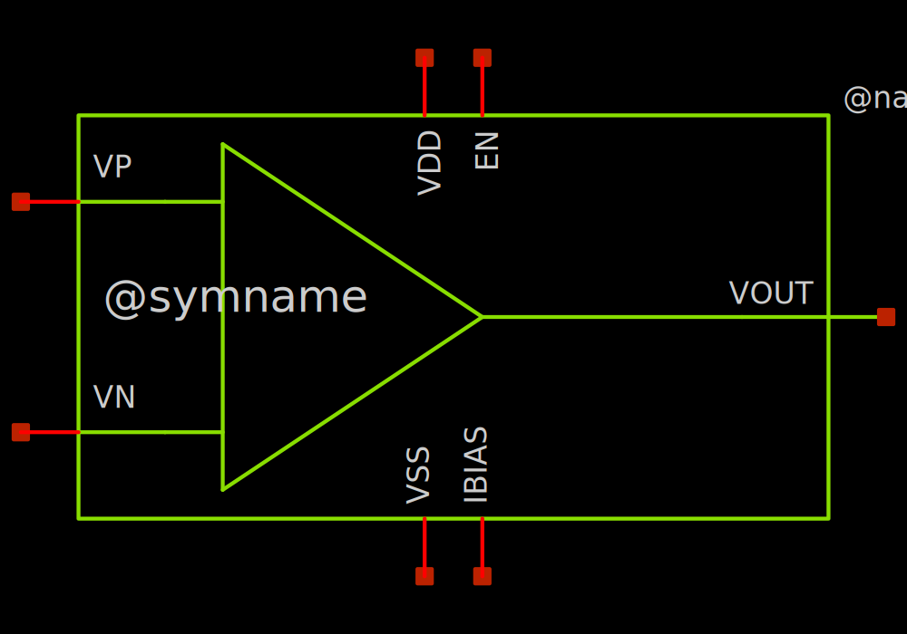
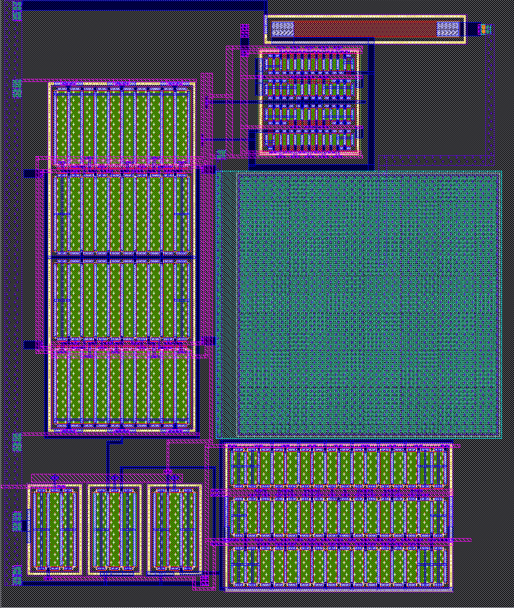

# ttsky25_two_stage_opamp

- Description: A Low-power Single-ended Operational Amplifier using Sky130 PDK
- PDK: sky130A

## Authorship

- Designer: R. M. Lochana Mihisara Katugaha
- Created: Sep 28, 2025
- License: Apache 2.0
- Company: None
- Last modified: None

## Pins

- VDD
  + Description: Positive analog power supply
  + Type: power
  + Direction: inout
  + Vmin: 1.7
  + Vmax: 1.9
- VSS
  + Description: Analog ground
  + Type: ground
  + Direction: inout
- IBIAS
  + Description: Bias current input
  + Type: signal
  + Direction: inout
- VP
  + Description: Voltage positive input
  + Type: signal
  + Direction: inout
- VN
  + Description: Voltage negative input
  + Type: signal
  + Direction: inout
- VOUT
  + Description: Voltage output
  + Type: signal
  + Direction: inout
- EN
  + Description: Digital ENABLE input
  + Type: signal
  + Direction: inout

## Default Conditions

- vdd
  + Description: Analog power supply voltage
  + Display: Vdd
  + Unit: V
  + Typical: 1.8
- vcm_diff
  + Description: Input common mode voltage is (vdd/2 - vcm_diff V) – (vdd/2 + vcm_diff V)
  + Display: vcm_diff
  + Unit: V
  + Typical: 0
- ibias
  + Description: Bias current
  + Display: Ibias
  + Unit: uA
  + Typical: 5
- cl
  + Description: Output load capacitance
  + Display: CLoad
  + Unit: pF
  + Typical: 25
- corner
  + Description: Process corner
  + Display: Corner
  + Typical: tt
- temperature
  + Description: Ambient temperature
  + Display: Temp
  + Unit: °C
  + Typical: 27
- lib_file
  + Description: lib.spice file
  + Display: Lib_file
  + Typical: ngspice

## Symbol

## Schematic

## Layout

