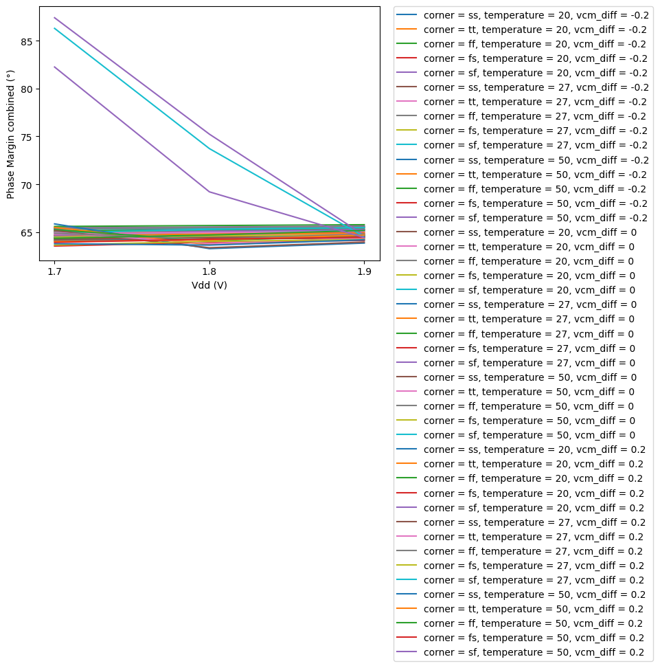
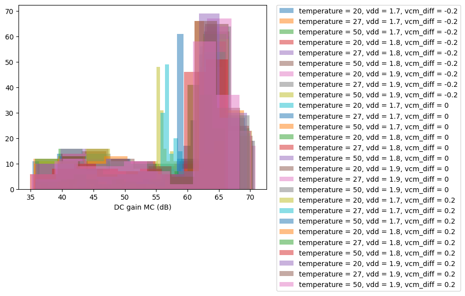

# CACE Summary for ttsky25_two_stage_opamp

**netlist source**: rcx

|      Parameter       |         Tool         |     Result      | Min Limit  |  Min Value   | Typ Target |  Typ Value   | Max Limit  |  Max Value   |  Status  |
| :------------------- | :------------------- | :-------------- | ---------: | -----------: | ---------: | -----------: | ---------: | -----------: | :------: |
| Netgen LVS           | netgen_lvs           | lvs_errors           |               ​ |          ​ |            ​ |          ​ |            0 |          0 |   Pass ✅    |
| DC gain              | ngspice              | gain_max             |             any |  27.878 dB |        60 dB |  65.332 dB |          any |  67.583 dB |   Pass ✅    |
| Unity Gain Frequency | ngspice              | ugf                  |           1 MHz |  1.801 MHz |          any | 16.160 MHz |          any | 20.124 MHz |   Pass ✅    |
| Phase Margin         | ngspice              | pm                   |            60 ° |   62.801 ° |          any |   64.684 ° |          any |   87.567 ° |   Pass ✅    |
| DC gain combined     | ngspice              | gain_max             |             any |  28.912 dB |        60 dB |  65.458 dB |          any |  68.217 dB |   Pass ✅    |
| Unity Gain Frequency combined | ngspice              | ugf                  |           1 MHz |  2.016 MHz |          any | 16.672 MHz |          any | 19.326 MHz |   Pass ✅    |
| Phase Margin combined | ngspice              | pm                   |            60 ° |   63.278 ° |          any |   64.724 ° |          any |   87.390 ° |   Pass ✅    |
| DC gain MC           | ngspice              | gain_max             |             any |  34.872 dB |          any |  61.709 dB |          any |  70.839 dB |   Pass ✅    |
| Unity Gain Frequency MC | ngspice              | ugf                  |             any |  9.689 MHz |          any | 15.817 MHz |          any | 18.620 MHz |   Pass ✅    |
| Phase Margin MC      | ngspice              | pm                   |             any |   63.430 ° |          any |   65.016 ° |          any |   74.464 ° |   Pass ✅    |
| Area                 | magic_area           | area                 |               ​ |          ​ |            ​ |          ​ |    11200 µm² | 2777.110 µm² |   Pass ✅    |
| Width                | magic_area           | width                |               ​ |          ​ |            ​ |          ​ |          any |  48.500 µm |   Pass ✅    |
| Height               | magic_area           | height               |               ​ |          ​ |            ​ |          ​ |          any |  57.260 µm |   Pass ✅    |
| Magic DRC            | magic_drc            | drc_errors           |               ​ |          ​ |            ​ |          ​ |            0 |          0 |   Pass ✅    |
| KLayout DRC feol     | klayout_drc          | drc_errors           |               ​ |          ​ |            ​ |          ​ |            0 |          0 |   Pass ✅    |
| KLayout DRC beol     | klayout_drc          | drc_errors           |               ​ |          ​ |            ​ |          ​ |            0 |          0 |   Pass ✅    |
| KLayout DRC full     | klayout_drc          | drc_errors           |               ​ |          ​ |            ​ |          ​ |            0 |          0 |   Pass ✅    |
| KLayout LVS          | klayout_lvs          | lvs_errors           |               ​ |          ​ |            ​ |          ​ |            0 |          0 |   Pass ✅    |
| Antenna Checks       | magic_antenna_check  | antenna_violations   |               ​ |          ​ |            ​ |          ​ |            0 |          0 |   Pass ✅    |

## Plots

## gain_vs_temp

## ugf_vs_corner

## pm_vs_vdd

## gain_vs_temp

## ugf_vs_corner

## pm_vs_vdd

## gain_mc

## ugf_mc

## pm_mc

## transient

